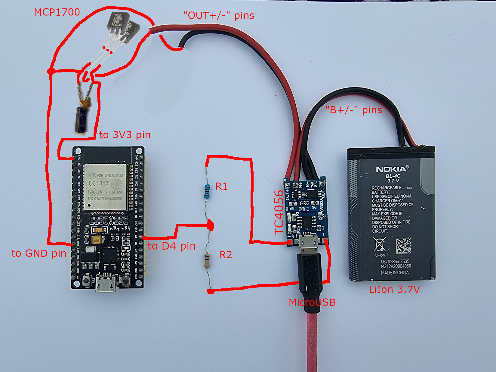

# telegram-power-info
This project submits messages into a Telegram chat when power goes out or is back on:

## Description and infrastructure requirements
The project is based on esp32 board, please use VSCode with PlatformIO to upload the software.
WiFi connectivity is required in a moment of status changes to be able to send the messages,
so some kind of UPS is required for your WiFi router. 
Esp32 also requires backup power to send the message, there are two ways to achieve this:

### Approach 1. Using LiIon battery for ESP32
This could be done using a regular LiIon 3.7v battery and charging board for example TC4056, please see this
[video](https://www.youtube.com/watch?v=Lk__xTxLlY0) for details. 
To reduce supply power to 3.3V a voltage regulator like MCP1700-3302E could be use, see this [video](https://www.youtube.com/watch?v=Z-36HflHotU)
for details. To power ESP32, two MCP1700-3302E could be used in parallel.
Short circuit of battery outputs never ends well so please be careful when working with the battery!
The single 5v power adapter could be used both to charge the esp32 battery and to detect the power outage.
So the full list of materials will be:
- ESP32 board
- TC4056 charging module
- Two MCP1700-3302E voltage regulators
- Two resistors: R1 = 1K, R2 = 2K (or other values with the same ratio R2 = 2 * R1)
- Electrolytic capacitor about ~1000uF (mind the polarity)
- Ceramic capacitor about ~100nF, any will work
- Phone USB charged and MicroUSB cable

### Approach 2. Using two power supplies
It is possible to use two 5v power supplies: one connected directly to detect power loss,
and another one connected to UPS to power esp32. In this case, grounds of both supplies should be connected.

Please note, that the backup power is required only to send the messages (even 1 minute is enough) and is NOT required for the
whole period of power outage.

The voltage divider circuit (two resistors, 2*R1 = R2 ) is used to reduce power probe voltage to 3.3v, please do not apply 5v to an input pin directly.

### Telegram settings
In Telegram, you need to determine chat id using @myidbot and create a bot that will submit the messages using @BotFather.
It is also required to add the bot to the chat.

### Viber implementation
Viber API gives an ability to implement something similar, but the technical implementation is much 
more demanding (it requires a server with callback URL and a kind of a database to track subscribed users)
so a simple Viber/Telegram switch will not be implemented here.

Your community affected by outages will enjoy it:

