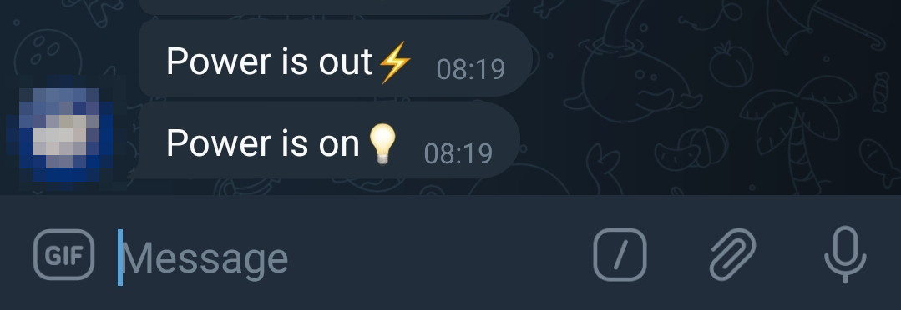
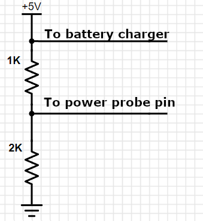
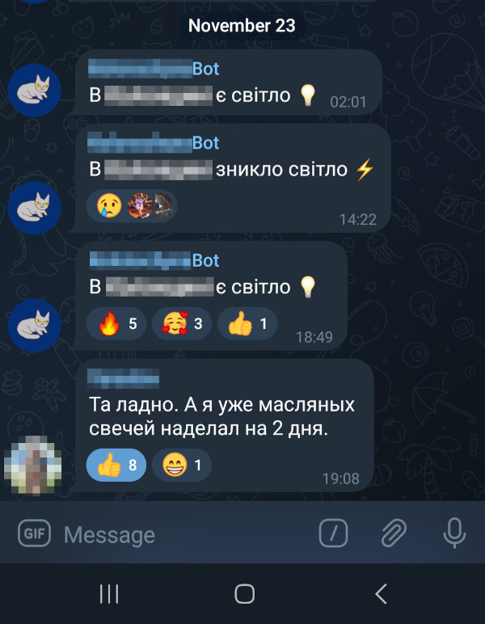

# telegram-power-info
This project submits messages when power goes out or is back on into a Telegram chat:

The project is based on esp32 board, please use VSCode with PlatformIO to upload the software.
WiFi connectivity is required in a moment of status chages to be able to send the messages,
so some king of UPS is required for your WiFi router. Esp32 also requires backup power, 
this could be done using a regular LiIon 3.7v battery and a DW01 based charging board, please see this
[video](https://www.youtube.com/watch?v=Lk__xTxLlY0) for details.

Please note, that the backup power is required only to send the messages and is NOT required for the
whole period of power outage.

The single 5v power adapter could be used both to charge the esp32 battery and to detect the power outage:

In Telegram, you need to determine chat id using @IDBot and create a bot that will submit the messages using @BotFather.
It is also required to add the bot to the chat.

